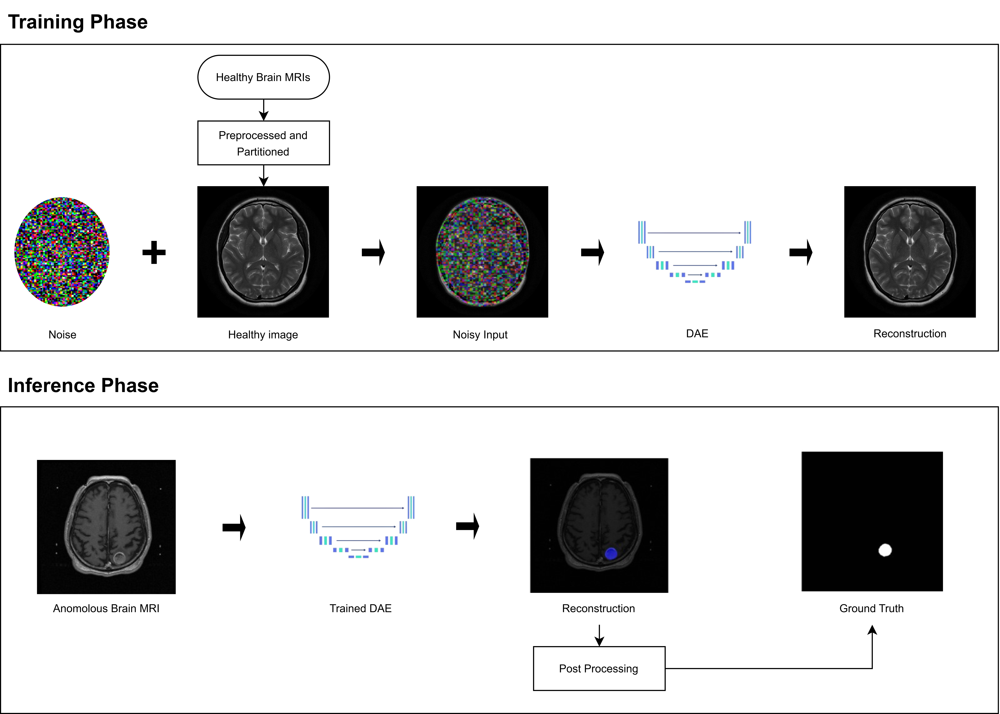

# Abnormalities Detection in Brain MRI Using Unsupervised Approach

This is a Final Year Project by **Gan Yee Jing** (Student ID: 22WMR15427), a student pursuing a **Bachelor Degree in Data Science (Honours)** at **Tunku Abdul Rahman University of Management and Technology (TAR UMT)**.

---

## 🧠 Project Overview

This project aims to develop an **unsupervised deep learning model** that detects abnormalities in **3D brain MRI scans**.  
The model is trained on healthy brain MRIs and learns to reconstruct only normal brain anatomy.

When given a test MRI (either healthy or pathological), the model reconstructs it as if it were healthy.  
If the brain contains abnormalities, the model fails to reconstruct these regions correctly, resulting in **high reconstruction error**.

These error regions are treated as **anomalies**, enabling localisation of abnormalities via an **anomaly map** generated from the reconstruction error.

---

## 🧭 Overall Workflow



---

## 🏗️ Model Architecture


- **Base Architecture**: Denoising Autoencoder  
  🔗 [Unsupervised Anomaly Detection on Brain MRI with Diffusion Models (Kascenas et al., 2022)](https://proceedings.mlr.press/v172/kascenas22a.html)

- **Modification**: Feature-wise Linear Modulation (FiLM) Layer  
  🔗 [FiLM: Visual Reasoning with a General Conditioning Layer (Perez et al., 2018)](https://doi.org/10.48550/arXiv.1709.07871)

---

## 📚 Datasets

### 🟢 Training Dataset (Healthy MRIs)
- **IXI Dataset**  
  🔗 [https://brain-development.org/ixi-dataset/](https://brain-development.org/ixi-dataset/)

### 🔴 Testing Datasets (MRIs with Pathologies)
1. **BraTS 2020 Dataset** – Tumor Detection  
   🔗 [https://www.kaggle.com/datasets/awsaf49/brats20-dataset-training-validation](https://www.kaggle.com/datasets/awsaf49/brats20-dataset-training-validation)

2. **MSLUB Dataset** – Multiple Sclerosis Detection  
   🔗 [https://lit.fe.uni-lj.si/en/research/resources/3D-MR-MS/](https://lit.fe.uni-lj.si/en/research/resources/3D-MR-MS/)

---

## 🗂️ Notes for Retraining the Model

- The `data/` folder **should include** preprocessed healthy and unhealthy brain MRI data.
- **However, due to storage constraints, the data is not provided here.**
- To prepare the data for retraining:
  1. Download the raw MRI datasets from the links provided in the "Datasets Used" section.
  2. Use `data_preprocessor.py` located in the `src/` folder to preprocess the data.
- ⚠️ **Important:**
  - When preprocessing **training data** (healthy brain MRIs), set `add_noise = True` to enable denoising for training the autoencoder.
  - When preprocessing **unhealthy (testing) data**, set `add_noise = False` to retain the original pathological features.

---
## 🚀 How to Deploy the Project

1. **Clone the repository**:

2. **Install dependencies**:

3. **Prepare the dataset**:
    - Download pathological raw MRI data from the links provided in the "Datasets" section. 

4. **Run the interface**:
    - Launch the Streamlit interface to interact with the model:
      ```bash
      streamlit run interface/main.py
      ```
---

## 🌐 Notes for Deploying the Model

- To enable the interface and data storing functionality:
  1. Create a MongoDB database to store results.
  2. Create a `.env` file in the root directory of the project.
  3. Add the following environment variables to the `.env` file:
     ```
     RAW_DATA_DIR=           # Absolute path to the folder containing raw MRI data
     PROJECT_ROOT=           # Absolute path to the root directory of the project
     MONGO_URI=              # MongoDB connection string
     ```
- Make sure MongoDB is accessible and running before launching the Streamlit interface.

---

## 📊 Results

- **Evaluation Metrics**: Dice score, Area Under Precision-Recall Curve (AUPRC)
- **Glioblastoma Detection**:
    - Dice Score: T1 (0.1593), T2 (0.2223)
    - AUPRC: T1 (0.0950), T2 (0.1087)
  
- **Multiple Sclerosis Detection**:
    - Dice Score: T1 (0.0168), T2 (0.0077)
    - AUPRC: T1 (0.0072), T2 (0.0021)

These results highlight the model's ability to detect glioblastoma tumors with some accuracy but struggle with detecting smaller, more diffuse abnormalities like multiple sclerosis lesions.

---


